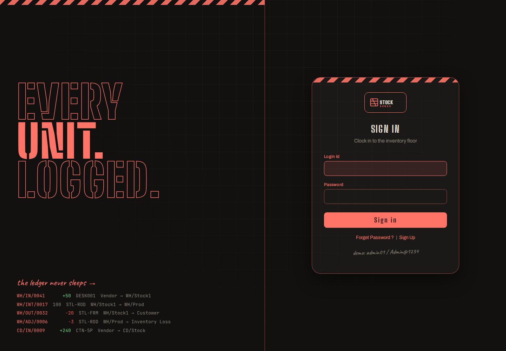
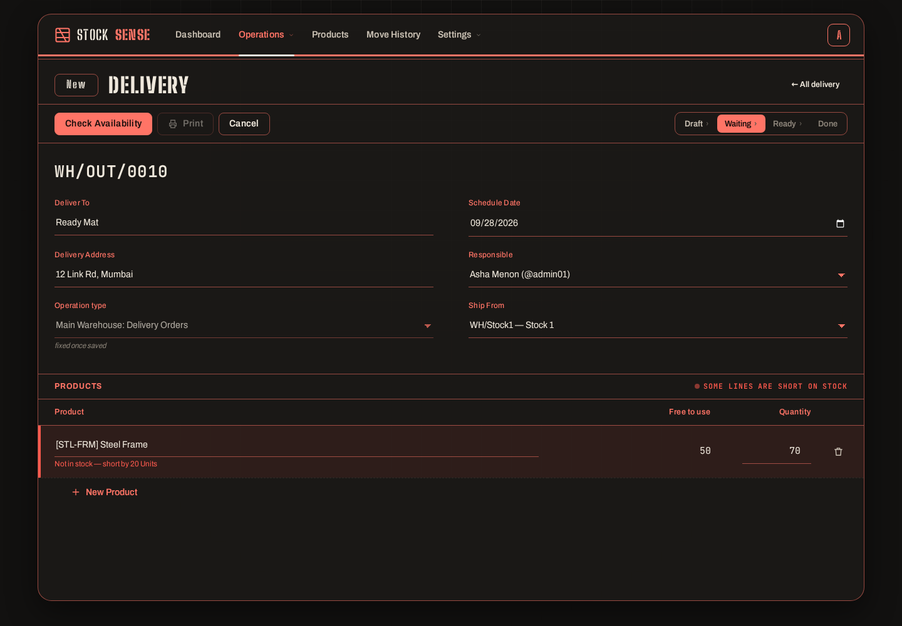
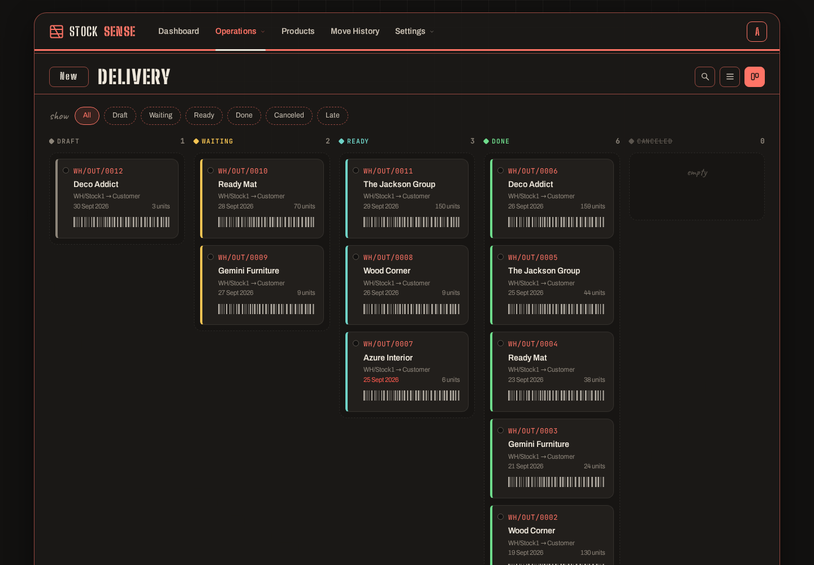
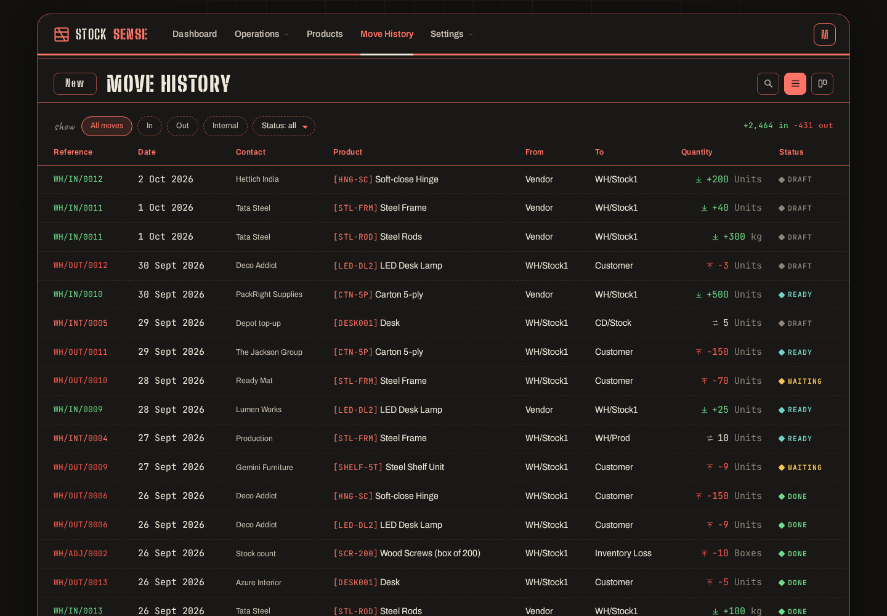
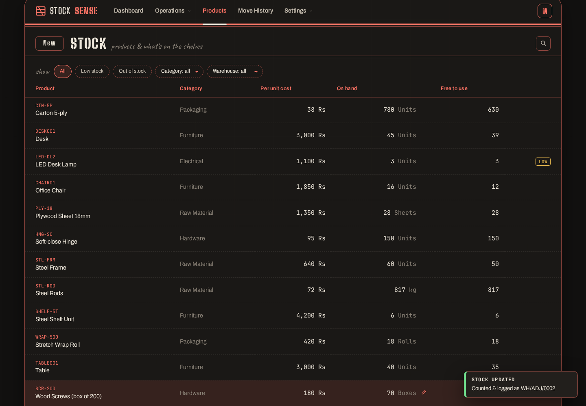
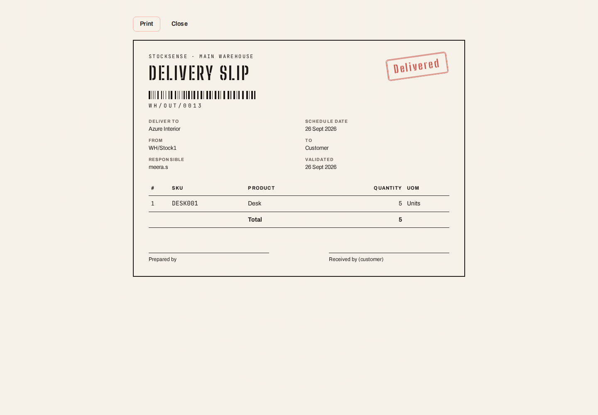
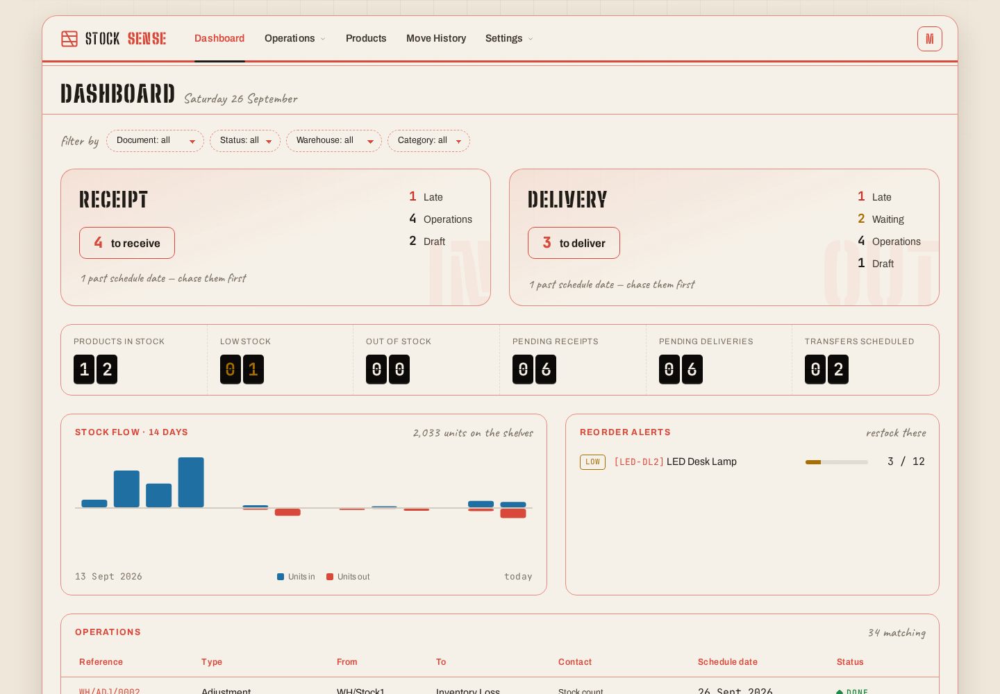

# StockSense

**A modular inventory management system that replaces registers and spreadsheets with one live stock ledger.**
Receipts, deliveries, internal transfers and stock counts all flow through the same engine, so every unit that
enters, moves or leaves a warehouse is logged and on-hand numbers can never drift.


## Quick start

Needs Node 20+.

```bash
npm run setup      # installs server + client and seeds two weeks of demo activity
npm run dev        # API on :4000, web app on http://localhost:5173
```

Demo accounts: **`admin01` / `Admin@1234`** and **`ravi.k` / `Ravi@12345`**.

Production-style single process: `npm run build && npm start` → http://localhost:4000.
`npm run seed` resets the database at any time.

OTP emails: copy `server/.env.example` to `server/.env` and fill in `SMTP_*`. Without SMTP the code is printed in
the server console and shown on the reset screen (dev mode only), so the flow always works in a demo.

## What's in it

| Wireframe screen | What it does |
|---|---|
| **Login / Sign up** | Login ID + password. Sign-up enforces the wireframe rules: login ID 6–12 chars and unique, email unique, password > 8 chars with lower, upper and special character. Wrong credentials show *"Invalid Login Id or Password"*. |
| **Forgot password** | 6-digit OTP (hashed, 10-minute expiry, 5 attempts) → new password. |
| **Dashboard** | Receipt card (*N to receive*, late, operations) and Delivery card (*N to deliver*, late, waiting, operations) as sketched. Plus a KPI board (products in stock, low / out of stock, pending receipts & deliveries, transfers scheduled), 14-day in/out flow chart, reorder alerts, and filters by document type, status, warehouse and category. |
| **Operations → Receipts / Delivery / Internal / Adjustments** | List view by default with search on reference & contact, one-click Kanban by status. References auto-increment as `<Warehouse>/<IN\|OUT\|INT\|ADJ>/<0001>`. |
| **Receipt / Delivery form** | Validate · Print · Cancel, status trail `Draft > Ready > Done` (receipts) and `Draft > Waiting > Ready > Done` (deliveries). *To Do* moves Draft → Ready; *Validate* moves Ready → Done. Responsible auto-fills with the signed-in user. Delivery lines that exceed free stock turn red with a notification, and the order waits until stock arrives. Print is available once Done. |
| **Products (Stock)** | Product, per unit cost, on hand, free to use. Update stock right from the row: every correction is recorded as an adjustment in the ledger. Create products with SKU, category, UoM, cost, reorder level and optional initial stock. Per-location breakdown on click. |
| **Move History** | Every move from → to, one row per product; incoming in green, outgoing in red. Search, filter by direction/status, Kanban by status. |
| **Settings → Warehouse / Locations** | Warehouse: name, short code, address. Location: name, short code, warehouse (racks, rooms, floors). |
| **Real-time** | Every open screen updates the moment anyone changes stock: no refresh. The server pushes a Server-Sent Event after each write; the dashboard counters flip, lists and stock numbers reload, and an open receipt/delivery shows a live toast if someone else validates it. The **LIVE** badge in the top bar blinks on each update. |
| **Profile menu** | My Profile (edit, change password), day/night theme, Logout. |

## How the stock engine works

```
            ┌──────────── operations (one table, four types) ────────────┐
 Vendor ──receipt──►  WH/Stock1 ──internal──► WH/Prod ──delivery──► Customer
                          │                                    ▲
                          └────── adjustment ◄──► Inventory Loss (virtual)
```

* **Every movement is `from → to`.** Vendors, customers and inventory loss are *virtual* locations, so a receipt,
  a delivery, a transfer and a count are all the same shape.
* **The ledger is the truth.** `validate()` runs in a single SQLite transaction: it checks stock, updates the
  per-location `quants` and appends rows to `moves`. It either all happens or none of it does.
  Negative stock and double validation are rejected.
* **Free to use = on hand − reserved.** Deliveries and transfers in *Ready* reserve their quantities, so two
  orders can't promise the same unit. *To Do* puts a delivery in **Ready** if it's covered and **Waiting** if not.
  *Check Availability* re-evaluates it.
* **Adjustments store the counted quantity.** On apply, the engine logs only the difference (e.g. counted 97 of
  100 → −3 to Inventory Loss).

## Stack

| | |
|---|---|
| Frontend | React 19 + Vite, React Router, hand-written CSS design system (no UI kit), self-hosted fonts |
| Backend | Node + Express 5, Zod validation, JWT auth, bcrypt, Nodemailer, Server-Sent Events for live updates |
| Database | SQLite via better-sqlite3 (zero setup) with foreign keys, CHECK constraints, indexes and transactions |

```
server/src
  db.js                 schema
  services/stock.js     the engine: references, availability, confirm/check/validate/cancel, quick counts
  routes/               auth · masters (warehouses, locations, categories, products) · operations · moves · dashboard
  seed.js               demo data played through the real engine
client/src
  ui/                   layout, kit (tags, trail, barcode, pickers, modal), toasts, icons
  pages/                Auth, Dashboard, OperationsList, OperationForm, PrintOperation, Stock, MoveHistory, Settings, Profile
```

## Screens

| | |
|---|---|
|  |  |
|  |  |
|  |  |

Day-shift theme: 
